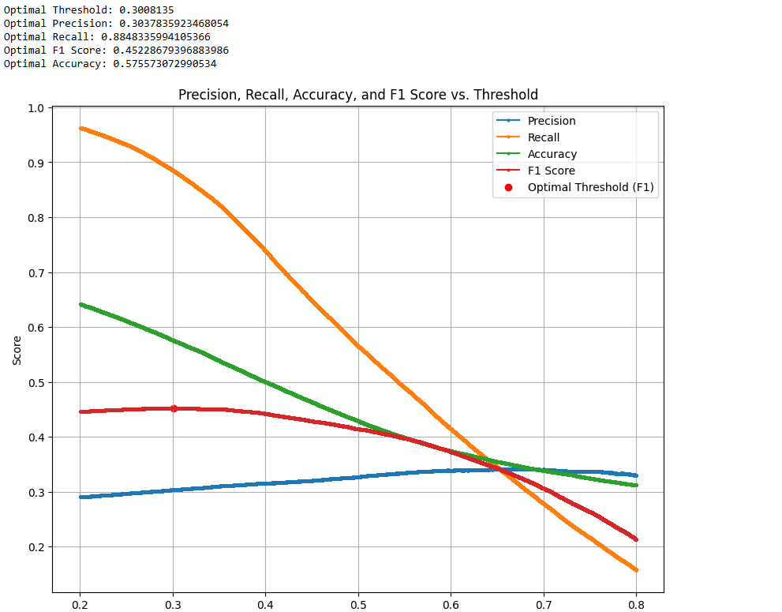

# Threshold from Precision-Recall curves
This repository is to calculate the optimal threshold from Precision-Recall curves.
The code reads a CSV file containing "Label" and "Probability" columns from a classifier output. The Probability column has a pair of scores for each given image like below:

| Label    | Probability               |
|----------|---------------------------|
| LumA     | [0.6257295  0.3742705]    |
| LumA     | [0.8945327  0.1054673]    |
| Not_LumA | [0.4448208  0.5551792]    |
| Not_LumA | [0.5010286  0.4989714]    |

The computed threshold can be used for further analysis of any binary classifier performance.
# Output

